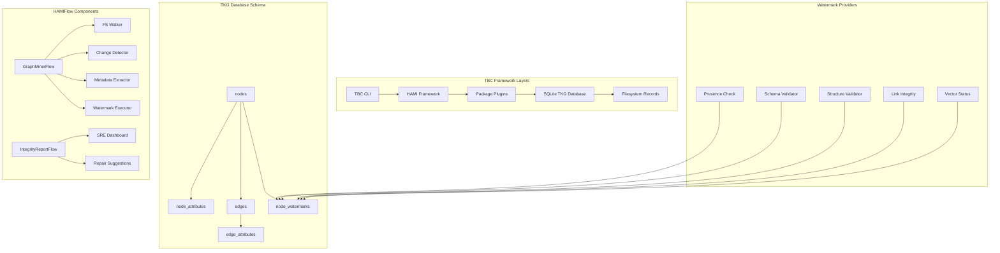

# Implementation Activity Log (2026-01-01)

## Context/Background

Preparing Implementation plan for TBC Health Check (SRE) development activity. After reading the [developer guide](doc/developer-guide.md), [tester guide](doc/tester-guide.md), and [user guide](doc/user-guide.md), I am aligned with the TBC framework principles: technology-agnostic records, git-first approach, plugin-based architecture, and agent-first design. The task is to develop a comprehensive health check script for TBC directory integrity, schema compliance, and link validation to support Site Reliability Engineering for autonomous TBC operations.

## Implementation Plan

### System Architecture Overview



### Design Considerations

- **IMPORTANT**: DO NOT CONFUSE 'Node' of the Temporal Knowledge Graph with HAMINode and PocketFlow Node - they are similar *but not* same concepts. HAMI/PocketFlow Node represent Execution Operation, and TKG Node represent Record Storage/Persistence.
- **Flow Implementation Pattern**: All TBC flows follow the established HAMIFlow pattern - extending HAMIFlow with config validation, startNode construction, and node chaining via .next(n('node-kind')). New flows (GraphMinerFlow, IntegrityReportFlow) will adhere to this pattern for consistency.
- All operations constructed as HAMINodes and HAMIFlows for optimal reusability. Flows are HAMIFlow classes that chain nodes using registry.createNode and .next()/.on() for error handling.
- **Mono-repo Architecture**: TBC uses Bun workspaces with interdependent packages. Development requires coordinated builds across packages.
- **Plugin-based Design**: Each package provides HAMINodes that are registered into the runtime via plugins.
- **Flow Composition**: Complex operations are built by composing simpler HAMINodes into directed graphs (HAMIFlows).

### Phase 1: General Temporal Knowledge Graph (TKG) Schema & ViewStore

**Objective**: Establish a flexible persistence layer in `tbc-view` that serves as a high-performance index for all TBC records, optimized for both integrity checks and future graph-based reasoning.

**1.1 Database Schema (SQLite via `bun:sqlite`)**
The schema is fully normalized to support temporal evolution and arbitrary metadata without altering the table structure. Located in `packages/tbc-view/src/ops/view-store.ts`.

```sql
-- Core node identity (immutable once created)
CREATE TABLE nodes (
    id TEXT PRIMARY KEY,           -- UUID v7 or TSID (from filename)
    collection TEXT NOT NULL,      -- 'mem', 'sys', 'act', 'dex', 'skills'
    record_type TEXT NOT NULL,     -- from YAML frontmatter
    hash TEXT NOT NULL,            -- Git-style SHA-256 blob hash for change detection
    last_seen_at INTEGER NOT NULL, -- Unix timestamp of last FS scan
    created_at INTEGER,            -- When first indexed (optional)
    file_path TEXT                 -- Relative path for quick FS access
);

-- Extensible key-value metadata store
CREATE TABLE node_attributes (
    node_id TEXT NOT NULL,
    key TEXT NOT NULL,             -- e.g., 'title', 'status', 'goal_owner', 'content'
    value TEXT,                    -- String or JSON string
    value_type TEXT NOT NULL,      -- 'string', 'number', 'boolean', 'json', 'null'
    updated_at INTEGER NOT NULL,   -- Last modification timestamp
    PRIMARY KEY (node_id, key),
    FOREIGN KEY (node_id) REFERENCES nodes(id) ON DELETE CASCADE
);

-- Explicit directed relationships between nodes
CREATE TABLE edges (
    source_id TEXT NOT NULL,
    target_id TEXT NOT NULL,       -- May reference non-existent node (Zombie detection)
    edge_type TEXT NOT NULL,       -- 'links_to', 'owned_by', 'parent_of', 'references'
    created_at INTEGER NOT NULL,   -- When relationship was discovered
    PRIMARY KEY (source_id, target_id, edge_type),
    FOREIGN KEY (source_id) REFERENCES nodes(id) ON DELETE CASCADE
);

-- Optional metadata for relationships
CREATE TABLE edge_attributes (
    source_id TEXT NOT NULL,
    target_id TEXT NOT NULL,
    edge_type TEXT NOT NULL,
    key TEXT NOT NULL,
    value TEXT,
    PRIMARY KEY (source_id, target_id, edge_type, key),
    FOREIGN KEY (source_id, target_id, edge_type) REFERENCES edges(source_id, target_id, edge_type) ON DELETE CASCADE
);

-- Integrity and processing status tracking (Watermarks)
CREATE TABLE node_watermarks (
    node_id TEXT NOT NULL,
    watermark_type TEXT NOT NULL,  -- 'presence', 'schema', 'structure', 'links', 'vector'
    status INTEGER NOT NULL,       -- 0=fail, 1=pass, 2=pending, 3=error
    message TEXT,                  -- Error details or processing notes
    updated_at INTEGER NOT NULL,   -- Last check timestamp
    checked_by TEXT,               -- Which HAMINode performed the check
    PRIMARY KEY (node_id, watermark_type),
    FOREIGN KEY (node_id) REFERENCES nodes(id) ON DELETE CASCADE
);

-- Indexes for performance
CREATE INDEX idx_nodes_collection ON nodes(collection);
CREATE INDEX idx_nodes_record_type ON nodes(record_type);
CREATE INDEX idx_edges_target ON edges(target_id);
CREATE INDEX idx_watermarks_status ON node_watermarks(status);
CREATE INDEX idx_watermarks_type ON node_watermarks(watermark_type);
```

**1.2 ViewStore Implementation**
- **Location**: `packages/tbc-view/src/ops/view-store.ts`
- **Dependencies**: `bun:sqlite` for native SQLite support
- **Methods**:
  - `initialize()`: Create tables and indexes
  - `upsertNode()`: Insert or update node with change detection
  - `upsertAttributes()`: Bulk attribute updates
  - `upsertEdges()`: Relationship management
  - `getWatermarkStatus()`: Query integrity status
  - `setWatermark()`: Update watermark status
- **Error Handling**: SQLite transactions with rollback on failure

**1.3 Integration with TBC View Package**
- Extend `TBCViewStorage` type to include `viewStore?: ViewStore`
- Update `packages/tbc-view/src/types.ts` with new storage fields
- Add ViewStore to plugin registration in `packages/tbc-view/src/plugin.ts`

### Phase 2: The Graph-Miner (HAMIFlow Engine)

**Objective**: A background-ready engine that synchronizes the filesystem state with the TKG and executes watermark checks.

**2.1 `GraphMinerFlow` Implementation**
Located in `packages/tbc-view/src/ops/graph-miner-flow.ts`, this HAMIFlow orchestrates the complete indexing pipeline following the established TBC flow pattern (illustrative code - may need to be tweaked and adjusted for actual implementation):

```typescript
interface GraphMinerFlowConfig {
    verbose: boolean;
}

class GraphMinerFlow extends HAMIFlow<Record<string, any>, GraphMinerFlowConfig> {
    startNode: Node;
    config: GraphMinerFlowConfig;

    constructor(config: GraphMinerFlowConfig) {
        const startNode = new Node();
        super(startNode, config);
        this.startNode = startNode;
        this.config = config;
    }

    kind(): string {
        return "tbc-view:graph-miner-flow";
    }

    async run(shared: Record<string, any>): Promise<string | undefined> {
        assert(shared.registry, 'registry is required');
        const n = shared.registry.createNode.bind(shared.registry);

        shared.opts = { verbose: this.config.verbose };
        shared.rootDirectory = shared.rootDirectory || process.cwd();

        // Wire the indexing pipeline
        this.startNode
            .next(n('tbc-view:fs-walker'))
            .next(n('tbc-view:change-detector'))
            .next(n('tbc-view:metadata-extractor'))
            .next(n('tbc-view:watermark-executor'))
            .next(n('core:log-result', {
                resultKey: 'indexingResults',
                format: 'table' as const,
                prefix: 'Indexing completed:',
                verbose: this.config.verbose
            }));

        return super.run(shared);
    }
}
```

**2.2 Core HAMINodes**

- **FSWalkerNode**: Recursively scans `mem/`, `sys/`, `skills/` directories
  - Filters by extension: `.md`, `.json`, `.yaml`, `.yml`
  - Extracts ID from filename (UUID or TSID)
  - Computes Git-style SHA-256 hash of file content

- **ChangeDetectorNode**: Compares current hash with stored hash
  - Queries `nodes` table for existing records
  - Returns only files with hash mismatches or new files

- **MetadataExtractorNode**: Parses file content and extracts relationships
  - YAML frontmatter parsing for attributes
  - Markdown link extraction: `[text](/mem/uuid.md)` → edges
  - Content hashing for change detection
  - Schema validation against TBC 0.4 specification

- **WatermarkExecutorNode**: Orchestrates watermark checks by calling individual HAMINodes
  - **PresenceWatermarkNode**: Verifies file exists and ID matches filename, updates 'presence' watermark
  - **SchemaWatermarkNode**: Validates YAML frontmatter structure, updates 'schema' watermark
  - **StructureWatermarkNode**: Checks mandatory H2 sections for temporal logs, updates 'structure' watermark
  - **RelationalWatermarkNode**: Detects broken links (Zombies) and disconnected records (Orphans), updates 'links' watermark
  - **VectorWatermarkNode**: Placeholder for future embedding status, updates 'vector' watermark

**2.3 Watermark Nodes**
Each watermark is implemented as a HAMINode that performs a specific integrity check and updates the watermark status for a given node_id.

```typescript
class PresenceWatermarkNode extends HAMINode {
  kind(): string { return 'tbc-view:presence-watermark'; }

  async prep(shared: any): Promise<{nodeId: string}> {
    return { nodeId: shared.nodeId };
  }

  async exec({nodeId}: {nodeId: string}): Promise<void> {
    const node = await shared.viewStore.getNode(nodeId);
    const fileExists = await fs.exists(node.file_path);
    const idMatches = path.basename(node.file_path, path.extname(node.file_path)) === node.id;
    const status = fileExists && idMatches ? 1 : 0;
    const message = fileExists ? (idMatches ? 'OK' : 'ID mismatch') : 'File not found';
    await shared.viewStore.setWatermark(nodeId, 'presence', status, message);
  }
}
```

### Phase 3: SRE Integrity Reporting & Repair

**Objective**: Translate the TKG state into actionable SRE reports and automated repair suggestions.

**3.1 `IntegrityReportFlow` Implementation**
Located in `packages/tbc-view/src/ops/integrity-report-flow.ts`, generates comprehensive health reports following TBC flow patterns (illustrative code - may need to be tweaked and adjusted for actual implementation):

```typescript
interface IntegrityReportFlowConfig {
    verbose: boolean;
    outputFormat: 'table' | 'json';
}

class IntegrityReportFlow extends HAMIFlow<Record<string, any>, IntegrityReportFlowConfig> {
    startNode: Node;
    config: IntegrityReportFlowConfig;

    constructor(config: IntegrityReportFlowConfig) {
        const startNode = new Node();
        super(startNode, config);
        this.startNode = startNode;
        this.config = config;
    }

    kind(): string {
        return "tbc-view:integrity-report-flow";
    }

    async run(shared: Record<string, any>): Promise<string | undefined> {
        assert(shared.registry, 'registry is required');
        const n = shared.registry.createNode.bind(shared.registry);

        shared.opts = { verbose: this.config.verbose };
        shared.rootDirectory = shared.rootDirectory || process.cwd();

        // Wire the reporting pipeline
        this.startNode
            .next(n('tbc-view:health-summary-query'))
            .next(n('tbc-view:zombie-detection'))
            .next(n('tbc-view:orphan-detection'))
            .next(n('tbc-view:schema-violation-check'))
            .next(n('tbc-view:repair-recommendations'))
            .next(n('tbc-view:report-generator'))
            .next(n('core:log-result', {
                resultKey: 'integrityReport',
                format: this.config.outputFormat,
                prefix: 'SRE Integrity Report:',
                verbose: this.config.verbose
            }));

        return super.run(shared);
    }
}
```

**3.2 SRE Dashboard Queries**
Complex SQL queries for health analysis:

```sql
-- System Health Summary
SELECT
  COUNT(*) as total_records,
  SUM(CASE WHEN status = 1 THEN 1 ELSE 0 END) as healthy_records,
  ROUND(
    SUM(CASE WHEN status = 1 THEN 1 ELSE 0 END) * 100.0 / COUNT(*),
    2
  ) as health_percentage
FROM node_watermarks
WHERE watermark_type IN ('presence', 'schema', 'structure', 'links');

-- Zombie Links (broken references)
SELECT
  e.source_id,
  e.target_id,
  n_src.collection as source_collection,
  n_src.record_type as source_type,
  e.edge_type
FROM edges e
JOIN nodes n_src ON e.source_id = n_src.id
LEFT JOIN nodes n_target ON e.target_id = n_target.id
WHERE n_target.id IS NULL;

-- Orphan Records (no incoming links)
SELECT
  n.id,
  n.collection,
  n.record_type,
  na_title.value as title
FROM nodes n
LEFT JOIN edges e ON n.id = e.target_id
LEFT JOIN node_attributes na_title ON n.id = na_title.node_id AND na_title.key = 'title'
WHERE n.collection IN ('mem', 'sys')
  AND e.source_id IS NULL;

-- Schema Violations
SELECT
  n.id,
  n.collection,
  n.record_type,
  w.message as violation_details
FROM nodes n
JOIN node_watermarks w ON n.id = w.node_id
WHERE w.watermark_type = 'schema' AND w.status = 0;
```

**3.3 Automated Repair Suggestions**
- **Missing Files**: Suggest record recreation from backups
- **Schema Violations**: Provide YAML correction templates
- **Broken Links**: Suggest alternative targets or record cleanup
- **Orphan Records**: Flag for manual review or archival

### Phase 4: CLI Integration & Commands

**Objective**: Integrate the TKG system into the TBC CLI with new commands for health checking and reporting.

**4.1 New CLI Commands**
Add to `apps/tbc-cli/src/index.ts`:

```bash
tbc view index     # Run GraphMinerFlow to build/update TKG
tbc view health    # Run IntegrityReportFlow and display SRE report
tbc view audit     # Comprehensive audit with repair suggestions
tbc view status    # Quick health summary
```

**4.2 CLI Flow Implementation**
Create new flows in `apps/tbc-cli/src/ops/`:

- **ViewIndexFlow**: Orchestrates GraphMinerFlow with CLI progress reporting
- **ViewHealthFlow**: Runs IntegrityReportFlow and formats output
- **ViewAuditFlow**: Combines indexing + health checking + repair suggestions
- **ViewStatusFlow**: Quick dashboard query for current health

**4.3 Command Registration**
Update CLI command definitions to include new view subcommands with proper help text and option parsing.

### Development Workflow (Mono-repo Considerations)

**5.1 Build Dependencies**
TBC uses Bun workspaces with strict build ordering:
```bash
# From repository root
bun run all:build  # Builds all packages in dependency order
```

**5.2 Development Scripts**
- `bun run view:build` - Build only tbc-view package
- `bun run cli:dev` - Build CLI and run in development mode
- `bun run cli:install` - Install CLI globally for testing

**5.3 Package Dependencies**
The TKG implementation requires:
- `@hami-frameworx/core` for HAMIFlow framework
- `pocketflow` for flow composition
- `bun:sqlite` for database operations

**5.4 Testing Isolation**
All testing must use `--root` flags to avoid corrupting the repository. Create test directories under `_test/` for development testing.  Install using `bun cli:install` and test  using `tbc` to avoid issues with working directories OR be sure to provide full path as `--root ${PWD}/_test/{some-test-instance}` while testing.

### Testing Strategy

**6.1 Unit Testing**
- There will be no Unit Tests setup at this stage of the project.

**6.2 Integration Testing**
- Only integration tests will be performed.  
- **GraphMinerFlow**: End-to-end indexing with test TBC instances
- **IntegrityReportFlow**: Report generation accuracy
- **CLI Commands**: Command parsing, flow execution, output formatting

**6.3 Test Data Setup**
Create test TBC instances using:
```bash
tbc sys init --root ./_test/integration --companion TestCompanion --prime Tester
```

**6.4 SRE Validation**
- Inject known integrity violations
- Verify detection accuracy
- Test repair suggestion quality

## Implementation Notes

- Analyzed existing TBC flow implementations and confirmed all follow the HAMIFlow pattern with standardized structure
- Updated pseudocode examples for GraphMinerFlow and IntegrityReportFlow to correctly demonstrate proper HAMIFlow construction using node chaining via registry.createNode and .next()
- Corrected architectural assumption that flows directly execute methods; instead they wire HAMINodes in the run() method

## Next/Open Items

_Immediate next items; should be emptied out as things are done, and a "ALL DONE" placed when activity completed_

- Tessera has:
  - Analyzed existing flow implementations and confirmed HAMIFlow pattern assumptions are correct
  - Updated Implementation Plan with flow pattern clarification
  - Awaiting explicit review and approval by Mahesh for GO-AHEAD on Implementation
- Mahesh should:
  - Review updated implementation plan, recommend changes, provide feedback.
  - Provide GO-AHEAD once all details/issues are addressed.
- Tessera will:
  - Proceed with implementation (use Code assistant if needed) after GO-AHEAD
  - Continuously update Implementation Notes and Next/Open Items to ensure progress is saved


## Deliverables/Outcomes

- {List of implemented components, files created, tests run}
- {Any issues encountered and resolutions}
- {Progress toward DoD}