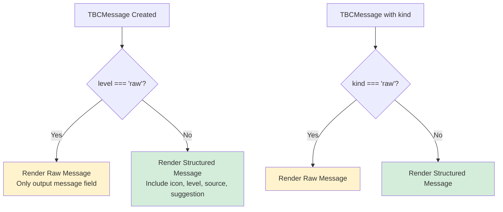

# Plan: Adding `kind` Field to TBCMessage

## Overview

This plan outlines the steps to add a new `kind` field to the `TBCMessage` interface to separate the concept of "message kind" (structured vs raw) from "log level" (debug/info/warn/error).

### Current Problem

Currently, `TBCLevel` includes `'raw'` as a value, which is used for UI formatting (decorative borders/separators) rather than actual logging levels. This causes confusion because:
- `'raw'` is not a real log level - it's a UI rendering mode
- Filtering by log level becomes difficult (can't easily separate UI decorations from actual log entries)
- The rendering logic in [`log-and-clear-messages.ts`](packages/tbc-system/src/ops/log-and-clear-messages.ts:18) has special-case handling for `level === 'raw'`

### Proposed Solution

Add a `kind` field to `TBCMessage` with values `'structured'` (default) and `'raw'`:

```typescript
type TBCMessageKind = 'structured' | 'raw';

interface TBCMessage {
    level: TBCLevel;           // 'debug' | 'info' | 'warn' | 'error'
    kind?: TBCMessageKind;     // 'structured' (default) | 'raw'
    source: string;
    code: string;
    message: string;
    suggestion?: string;
}
```

The `level` would then only contain actual log levels, and `kind: 'raw'` would indicate a UI-only message.

---

## Phase 1: Type Definition Changes

### 1.1 Update [`packages/tbc-system/src/types.ts`](packages/tbc-system/src/types.ts)

- [ ] Add new type `TBCMessageKind = 'structured' | 'raw'`
- [ ] Modify `TBCLevel` to remove `'raw'` - now only: `'debug' | 'info' | 'warn' | 'error'`
- [ ] Add optional `kind` field to `TBCMessage` interface with default `'structured'`
- [ ] Update `TBC_LEVEL_ICON_MAP` - remove the `raw` entry (no longer needed)
- [ ] Export `TBCMessageKind` alongside other types

---

## Phase 2: Update Message Rendering

### 2.1 Update [`packages/tbc-system/src/ops/log-and-clear-messages.ts`](packages/tbc-system/src/ops/log-and-clear-messages.ts)

- [ ] Update `composeMessage()` function to check `kind === 'raw'` instead of `level === 'raw'`
- [ ] Maintain backward compatibility: if `kind` is undefined but `level === 'raw'`, treat as raw for migration period

---

## Phase 3: Update All Message Producers

### 3.1 Files using `level: 'raw'` - tbc-system package

| File | Line Count | Action Required |
|------|------------|-----------------|
| [`packages/tbc-system/src/ops/add-minted-messages.ts`](packages/tbc-system/src/ops/add-minted-messages.ts) | 4 | Change to `kind: 'raw'` |
| [`packages/tbc-system/src/ops/add-identity-messages.ts`](packages/tbc-system/src/ops/add-identity-messages.ts) | 4 | Change to `kind: 'raw'` |
| [`packages/tbc-system/src/ops/add-manifest-messages.ts`](packages/tbc-system/src/ops/add-manifest-messages.ts) | 4 | Change to `kind: 'raw'` |
| [`packages/tbc-system/src/ops/dex-rebuild-flow.ts`](packages/tbc-system/src/ops/dex-rebuild-flow.ts) | 3 | Change to `kind: 'raw'` |
| [`packages/tbc-system/src/ops/init-flow.ts`](packages/tbc-system/src/ops/init-flow.ts) | 3 | Change to `kind: 'raw'` |
| [`packages/tbc-system/src/ops/probe.ts`](packages/tbc-system/src/ops/probe.ts) | 9 | Change to `kind: 'raw'` |
| [`packages/tbc-system/src/ops/resolve-protocol.ts`](packages/tbc-system/src/ops/resolve-protocol.ts) | 2 | Change to `kind: 'raw'` |
| [`packages/tbc-system/src/ops/upgrade-flow.ts`](packages/tbc-system/src/ops/upgrade-flow.ts) | 3 | Change to `kind: 'raw'` |
| [`packages/tbc-system/src/ops/validate-system.ts`](packages/tbc-system/src/ops/validate-system.ts) | 3 | Change to `kind: 'raw'` |

### 3.2 Files using `level: 'raw'` - tbc-activity package

| File | Line Count | Action Required |
|------|------------|-----------------|
| [`packages/tbc-activity/src/ops/act-start-flow.ts`](packages/tbc-activity/src/ops/act-start-flow.ts) | 3 | Change to `kind: 'raw'` |
| [`packages/tbc-activity/src/ops/act-pause-flow.ts`](packages/tbc-activity/src/ops/act-pause-flow.ts) | 3 | Change to `kind: 'raw'` |
| [`packages/tbc-activity/src/ops/act-close-flow.ts`](packages/tbc-activity/src/ops/act-close-flow.ts) | 3 | Change to `kind: 'raw'` |
| [`packages/tbc-activity/src/ops/act-show-flow.ts`](packages/tbc-activity/src/ops/act-show-flow.ts) | 2 | Change to `kind: 'raw'` |

### 3.3 Files using `level: 'raw'` - tbc-memory package

| File | Line Count | Action Required |
|------|------------|-----------------|
| [`packages/tbc-memory/src/ops/add-recall-messages.ts`](packages/tbc-memory/src/ops/add-recall-messages.ts) | 3 | Change to `kind: 'raw'` |
| [`packages/tbc-memory/src/ops/remember-flow.ts`](packages/tbc-memory/src/ops/remember-flow.ts) | 3 | Change to `kind: 'raw'` |

### 3.4 Files using `level: 'raw'` - tbc-interface package

| File | Line Count | Action Required |
|------|------------|-----------------|
| [`packages/tbc-interface/src/ops/agent-integrate-flow.ts`](packages/tbc-interface/src/ops/agent-integrate-flow.ts) | 3 | Change to `kind: 'raw'` |

---

## Phase 4: Fix Type Errors (Known Issues)

### 4.1 Fix invalid level in [`packages/tbc-activity/src/ops/prepare-workspace.ts`](packages/tbc-activity/src/ops/prepare-workspace.ts:80)

- [ ] Line 80 uses `level: 'success'` which is invalid - this is a bug that should be fixed
- [ ] Change to use a proper level (e.g., `'info'`) since `'success'` is not a valid `TBCLevel`

---

## Phase 5: Validation

### 5.1 Run Full Build and Test Suite

Execute the validation command specified by the user:

```bash
bun all:build-dist
```

This runs the full build, test, and packaging suite as defined in [`package.json`](package.json:34).

### 5.2 Expected Outcomes

- [ ] All TypeScript compilation succeeds
- [ ] All tests pass
- [ ] All packages build and package correctly
- [ ] No type errors related to TBCMessage

---

## Migration Strategy

### Backward Compatibility

The plan maintains backward compatibility during migration:

1. **Optional `kind` field**: The `kind` field is optional. If not provided, the rendering logic falls back to checking `level === 'raw'` for backward compatibility.

2. **Gradual migration**: All message producers can be updated incrementally.

3. **Type safety**: Once migration is complete, `level` will only contain valid log levels, enabling proper filtering and level-based operations.

### After Migration (Optional Cleanup)

Once all producers are updated, you can:
- [ ] Make `kind` required instead of optional
- [ ] Remove backward compatibility check in rendering logic
- [ ] Consider removing `'raw'` from any documentation about TBCLevel

---

## Summary Statistics

| Category | Count |
|----------|-------|
| Type definition files to update | 1 |
| Rendering files to update | 1 |
| Message producer files to update | 15 |
| Total raw message occurrences | ~50 |
| Packages affected | 5 (tbc-system, tbc-activity, tbc-memory, tbc-interface, tbc-write) |

---

## Implementation Notes

### Key Insights from Analysis

1. **Rendering Logic**: The [`composeMessage()`](packages/tbc-system/src/ops/log-and-clear-messages.ts:13) function in `log-and-clear-messages.ts` is the central place where raw messages are handled differently - they skip the standard formatting and just output the raw message text.

2. **Shared Stage Pattern**: Messages are pushed to `shared.stage.messages` (and sometimes aliased as `s.stage.messages`) throughout the codebase. The pattern is consistent:
   ```typescript
   shared.stage.messages = shared.stage.messages || [];
   shared.stage.messages.push({ level: 'raw', message: '...' });
   ```

3. **Current TBCLevel Values**: `'debug' | 'info' | 'warn' | 'error' | 'raw'`

4. **TBC_LEVEL_ICON_MAP**: Currently has `'raw': ''` which will be removed.

### Mermaid Diagram: Current vs Proposed Flow



---

## Files Reference

### Primary Type Definition
- [`packages/tbc-system/src/types.ts`](packages/tbc-system/src/types.ts) - Contains `TBCMessage`, `TBCLevel`, `TBC_LEVEL_ICON_MAP`

### Message Rendering
- [`packages/tbc-system/src/ops/log-and-clear-messages.ts`](packages/tbc-system/src/ops/log-and-clear-messages.ts) - Contains `composeMessage()` and `composeMessages()`

### All Files Using level: 'raw'
See Phase 3 above for the complete list of 15 files that need updating.
